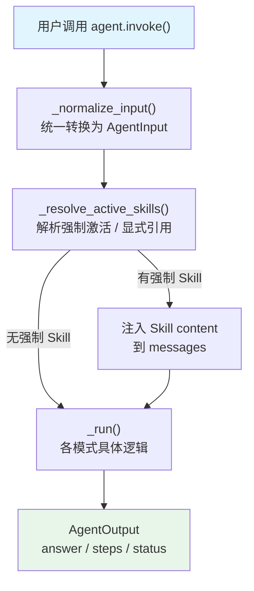
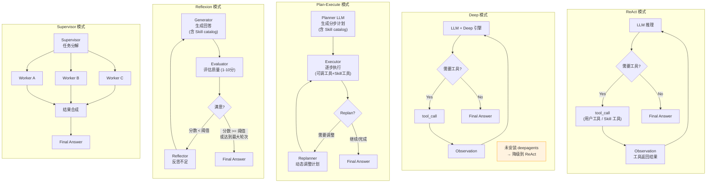
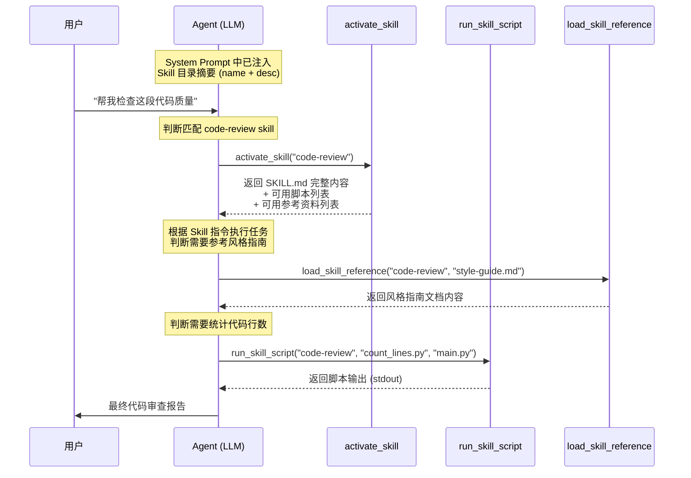
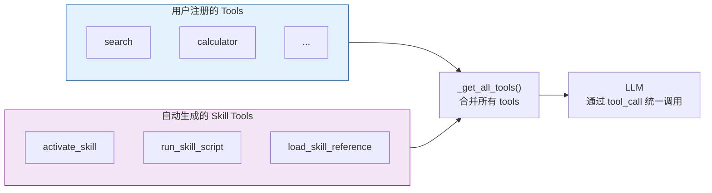
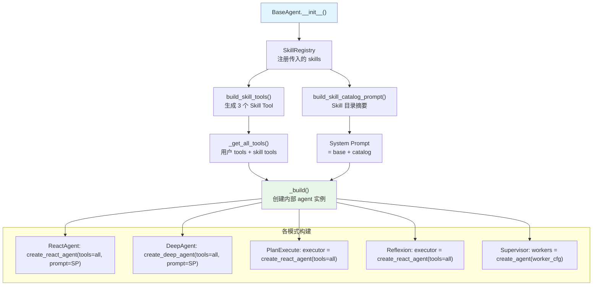

# Flux-Agent 智能 Agent 模块

> 开箱即用的多模式 Agent 能力

## 概述

`flux_agent.agents` 模块提供了多种开箱即用的 Agent 模式，所有模式通过统一的接口调用，输出格式完全一致。

## 架构总览

### 统一调用流程



### 四种 Agent 模式流程



### Skill 三层渐进式加载（Tool 驱动闭环）



### Tool 与 Skill Tool 的融合



### 构建阶段（_build）全景



## 安装

```bash
# 基础安装（ReAct、Plan-Execute、Reflexion）
pip install flux-agent

# 完整安装（包含 Deep 模式）
pip install flux-agent[agents]
```

## 快速开始

```python
from langchain_openai import ChatOpenAI
from flux_agent.agents import create_agent

llm = ChatOpenAI(model="gpt-4o")

# 创建 Agent
agent = create_agent("react", llm=llm)

# 执行
result = agent.invoke("什么是量子计算？")

# 获取结果
print(result.answer)
```

## 支持的 Agent 模式

| 模式 | 说明 | 适用场景 |
|------|------|----------|
| `react` | ReAct 模式，推理+行动循环 | 简单问答、工具调用 |
| `deep` | Deep 模式，任务规划+文件系统 | 复杂任务、代码生成 |
| `plan_execute` | 先规划再执行 | 多步骤任务、研究型任务 |
| `reflexion` | 自我反思改进 | 代码生成、高质量输出 |
| `supervisor` | 任务分解+分发+合成 | 多角色协作、复杂编排 |

## 统一接口

### AgentInput

```python
from flux_agent.agents import AgentInput

input = AgentInput(
    query="你的问题",              # 必填：用户的问题/任务
    messages=[...],               # 可选：对话历史
    context="额外上下文",          # 可选：额外信息
    system_prompt="自定义提示词",  # 可选：覆盖默认提示词
    max_steps=10,                 # 可选：最大步数
    config={}                     # 可选：模式特定配置
)
```

### AgentOutput

```python
result = agent.invoke("问题")

result.answer         # 最终回答
result.status         # 执行状态: success/failed/partial/interrupted
result.steps          # 执行步骤列表
result.total_steps    # 总步数
result.elapsed_time   # 耗时(秒)
result.error          # 错误信息(如有)
result.metadata       # 额外元数据
```

## 详细用法

### ReAct 模式

ReAct（Reasoning + Acting）是最常用的 Agent 模式，适合简单的问答和工具调用场景。

```python
from langchain_openai import ChatOpenAI
from langchain_community.tools import TavilySearchResults
from flux_agent.agents import create_agent

llm = ChatOpenAI(model="gpt-4o")
search = TavilySearchResults()

agent = create_agent(
    "react",
    llm=llm,
    tools=[search],
)

result = agent.invoke("今天北京天气怎么样？")
print(result.answer)
```

### Deep 模式

Deep 模式提供更强大的能力：任务规划、文件系统、子 Agent 等。

```python
agent = create_agent(
    "deep",
    llm=llm,
    tools=[search],
)

result = agent.invoke("分析2024年AI领域的重要突破")
```

> **注意**: Deep 模式需要安装 `deepagents`: `pip install flux-agent[agents]`。未安装时会自动降级到 ReAct 模式。

### Plan-Execute 模式

适合复杂的多步骤任务，先制定计划再逐步执行。

```python
agent = create_agent(
    "plan_execute",
    llm=llm,
    tools=[search],
    enable_replan=True,  # 启用动态重规划
)

result = agent.invoke("分析中国新能源汽车市场趋势并给出投资建议")

# 查看生成的计划
print(result.metadata.get("plan"))
```

**工作流程**：
1. Planner 生成执行计划
2. Executor 逐步执行
3. Replanner 根据结果调整计划（可选）

### Reflexion 模式

通过自我反思不断改进输出质量，适合代码生成、写作等需要高质量输出的场景。

```python
agent = create_agent(
    "reflexion",
    llm=llm,
    max_iterations=3,        # 最多反思 3 轮
    quality_threshold=8.0,   # 8 分以上满意
)

result = agent.invoke("写一个 Python 快速排序算法，要求有完整注释和单元测试")

# 查看反思过程
from flux_agent.agents import StepType
for step in result.get_steps_by_type(StepType.REFLECTION):
    print(f"反思: {step.content[:200]}...")
```

**工作流程**：
1. Generator 生成初始回答
2. Evaluator 评估质量
3. Reflector 反思不足
4. Generator 改进回答
5. 循环直到满意或达到最大轮次

## 统一输出格式

所有模式的输出格式完全一致：

```python
# 不管什么模式
for mode in ["react", "plan_execute", "reflexion"]:
    agent = create_agent(mode, llm=llm)
    result = agent.invoke("问题")
    
    print(f"模式: {result.agent_mode.value}")
    print(f"回答: {result.answer}")
    print(f"状态: {result.status.value}")
    print(f"步数: {result.total_steps}")
    print(f"耗时: {result.elapsed_time:.2f}s")
```

## 多种调用方式

```python
agent = create_agent("react", llm=llm)

# 方式1：字符串
result = agent.invoke("你好")

# 方式2：字典
result = agent.invoke({"query": "你好", "max_steps": 5})

# 方式3：AgentInput 对象
result = agent.invoke(AgentInput(
    query="你好",
    context="用户是程序员",
    max_steps=5,
))
```

## Skill 能力

Agent 支持 Skill 系统 — 为 Agent 注入领域知识、执行脚本、引用资料的模块化扩展机制。

```python
from flux_agent.agents import create_agent, SkillLoader, AgentInput

loader = SkillLoader("skills")
agent = create_agent("react", llm=llm, skills=loader.load_all())

# Agent 自主选择 Skill
result = agent.invoke("帮我检查一下代码质量")

# 强制激活指定 Skill
result = agent.invoke(AgentInput(
    query="检查这段代码",
    active_skills=["code-review"],
))
```

> 完整文档请参阅 [Skill 系统文档](SKILLS.md)

### Supervisor 模式

Supervisor 模式实现 Agent 内部的任务编排 — 自动将复杂 query 分解为子任务，分发给不同 worker agent 执行，最终合成统一回答。适合需要多角色协作的复杂场景。

```python
from langchain_openai import ChatOpenAI
from flux_agent.agents import create_agent, WorkerConfig

llm = ChatOpenAI(model="gpt-4o")

# 手动模式：显式指定 worker
supervisor = create_agent(
    "supervisor",
    llm=llm,
    workers={
        "researcher": WorkerConfig(
            name="researcher",
            mode="react",
            description="负责搜索和调研",
            tools=["web_search"],
        ),
        "writer": WorkerConfig(
            name="writer",
            mode="plan_execute",
            description="负责撰写报告",
            tools=["write_file"],
        ),
    },
)

result = supervisor.invoke("调研 AI 行业最新动态并写一份总结报告")
print(result.answer)
```

**工作流程**：
1. **任务分解** — LLM 将 query 拆分为子任务，分配到对应 worker
2. **分发执行** — 并行（默认）或串行调用 worker agent
3. **结果合成** — LLM 汇总所有 worker 结果，生成统一回答

#### 手动模式 vs 自动模式

Supervisor 支持两种工作方式：

**手动模式**（传入 `workers` 参数）：显式指定每个 worker 的角色、模式和工具。适合 worker 职责明确、需要精确控制的场景。

**自动模式**（不传 `workers`）：LLM 动态规划需要哪些角色，并自动分配工具。适合任务类型不确定、需要灵活应对的场景。

```python
# 自动模式：不传 workers，LLM 自行判断
supervisor = create_agent(
    "supervisor",
    llm=llm,
    tools=[web_search, write_file, calculator],  # 可用工具池
)

result = supervisor.invoke("分析2024年手机市场销量数据并写报告")
# LLM 会自动规划：需要一个 data_analyst（用 calculator）和一个 writer（用 write_file）
```

#### 工具继承机制

Supervisor 的 `tools` 参数是**可用工具池**，每个 worker 通过 `WorkerConfig.tools` 声明自己需要的工具名列表。在 `_build()` 阶段，系统会从 supervisor 的工具池中按名称筛选出对应的 `BaseTool` 实例传递给 worker：

```python
supervisor = create_agent(
    "supervisor",
    llm=llm,
    tools=[web_search, write_file, calculator, code_executor],  # 总工具池
    workers={
        "researcher": WorkerConfig(
            name="researcher", mode="react",
            description="负责搜索",
            tools=["web_search"],  # 只拿 web_search
        ),
        "developer": WorkerConfig(
            name="developer", mode="react",
            description="负责写代码",
            tools=["code_executor", "write_file"],  # 拿 code_executor 和 write_file
        ),
    },
)
```

自动模式下，LLM 规划 worker 时也会根据可用工具列表为每个角色分配合适的工具。

#### 混合工具场景示例

```python
from langchain_community.tools import TavilySearchResults
from flux_agent.agents import create_agent, WorkerConfig

search = TavilySearchResults()

# 假设自定义工具已在 tool registry 中注册
supervisor = create_agent(
    "supervisor",
    llm=llm,
    tools=[search],  # 工具池
    parallel=True,   # 并行执行 worker（默认值）
    workers={
        "researcher": WorkerConfig(
            name="researcher", mode="react",
            description="负责搜索最新信息",
            tools=["tavily_search_results_json"],  # 按工具名指定
        ),
        "analyst": WorkerConfig(
            name="analyst", mode="react",
            description="负责数据分析",
            tools=[],  # 不需要工具，纯分析
        ),
    },
)

result = supervisor.invoke("分析 Python 3.13 的新特性并总结")
```

## 自定义 Agent 模式

通过 `AgentRegistry` 注册自定义 Agent：

```python
from flux_agent.agents import BaseAgent, AgentMode, AgentInput, AgentOutput, AgentRegistry

@AgentRegistry.register("my_custom")
class MyCustomAgent(BaseAgent):
    @property
    def mode(self) -> AgentMode:
        return "my_custom"
    
    def _build(self):
        # 构建内部逻辑
        pass
    
    def _run(self, agent_input: AgentInput) -> AgentOutput:
        # 执行逻辑
        response = self.llm.invoke(agent_input.to_messages())
        return AgentOutput(
            answer=response.content,
            status="success",
            agent_mode=self.mode,
            steps=[],
            total_steps=1,
        )

# 使用自定义模式
agent = create_agent("my_custom", llm=llm)
```

## 步骤级实时回调

通过 `AgentConfig.on_step` 可以为 Agent 配置一个步骤级回调函数。每完成一个步骤，回调函数会立即被调用，实时推送中间进度。

```python
from flux_agent.agents import create_agent, AgentConfig

def on_step(step):
    print(f"[{step.step_type.value}] {step.content[:100]}")

agent = create_agent(
    "react",
    llm=llm,
    tools=[search],
    config=AgentConfig(on_step=on_step),
)

# 每执行一步都会实时触发 on_step
result = agent.invoke("分析问题")
```

### 各模式支持情况

| 模式 | 实现方式 |
|------|----------|
| `react` | `agent.stream()` 逐事件解析，实时回调 |
| `deep` | `agent.stream()` 逐事件解析，实时回调 |
| `plan_execute` | 手动循环中每步后调用 `_emit_step` |
| `reflexion` | 手动循环中每步后调用 `_emit_step` |
| `supervisor` | 手动循环中每步后调用 `_emit_step`（分解步骤 + worker 完成步骤） |

> **注意**：未配置 `on_step` 时，所有模式的 `_run` 代码完全不变，行为与之前完全一致。回调抛异常不会影响主流程。

### AgentStep 字段

```python
step.step_index    # 步骤序号
step.step_type     # 步骤类型: thought/action/observation/plan/reflection/final_answer
step.content       # 步骤内容
step.tool_name     # 使用的工具名（如有）
step.tool_input    # 工具输入（如有）
step.tool_output   # 工具输出（如有）
step.timestamp     # 时间戳
```

## 回调监控

```python
from flux_agent.agents import AgentCallback, AgentConfig
from flux_agent.agents.utils import PrintCallback

# 使用内置打印回调
agent = create_agent(
    "react",
    llm=llm,
    config=AgentConfig(verbose=True),
)

# 自定义回调
class MyCallback(AgentCallback):
    def on_step(self, step):
        print(f"Step {step.step_index}: {step.step_type.value}")

    def on_agent_end(self, output):
        print(f"完成: {output.total_steps} 步")

agent = create_agent(
    "plan_execute",
    llm=llm,
    config=AgentConfig(callbacks=[MyCallback()]),
)
```

## 与 LangGraph 编排结合

```python
from langgraph.graph import StateGraph, START, END

# 创建不同模式的 Agent
researcher = create_agent("react", llm=llm, tools=[search])
writer = create_agent("reflexion", llm=llm)

# 编排工作流
def research_node(state):
    result = researcher.invoke(state["query"])
    return {"research": result.answer}

def write_node(state):
    prompt = f"基于研究写报告: {state['research']}"
    result = writer.invoke(prompt)
    return {"report": result.answer}

graph = StateGraph(dict)
graph.add_node("research", research_node)
graph.add_node("write", write_node)
graph.add_edge(START, "research")
graph.add_edge("research", "write")
graph.add_edge("write", END)

workflow = graph.compile()
result = workflow.invoke({"query": "分析AI趋势"})
```

## API 参考

### create_agent()

```python
def create_agent(
    mode: str | AgentMode,      # Agent 模式
    llm: BaseChatModel,          # LLM 实例
    tools: list[BaseTool] = None, # 工具列表
    system_prompt: str = None,    # 系统提示词
    config: AgentConfig = None,   # Agent 配置
    **kwargs,                     # 模式特定参数
) -> BaseAgent
```

### AgentConfig

| 参数 | 类型 | 默认值 | 说明 |
|------|------|--------|------|
| `verbose` | bool | False | 是否打印详细日志 |
| `max_steps` | int | 10 | 最大执行步数 |
| `temperature` | float | 0.0 | LLM 温度 |
| `callbacks` | list | None | 回调列表 |
| `on_step` | `Callable[[AgentStep], None]` | None | 步骤级实时回调函数 |

### 模式特定参数

**PlanExecuteAgent**:
- `enable_replan`: 是否启用动态重规划

**ReflexionAgent**:
- `max_iterations`: 最大反思轮次
- `quality_threshold`: 质量阈值（1-10）
- `evaluator_llm`: 评估用的 LLM（可与生成器不同）

**SupervisorAgent**:
- `workers`: Worker 配置字典（`Dict[str, WorkerConfig]`），传入为手动模式，不传为自动模式
- `parallel`: 是否并行执行 worker（默认 `True`）

## 更多资源

- [Skill 系统文档](SKILLS.md)
- [配置参考](CONFIG_REFERENCE.md)
- [节点开发](NODE_DEVELOPMENT.md)
- [使用指南](USAGE.md)
